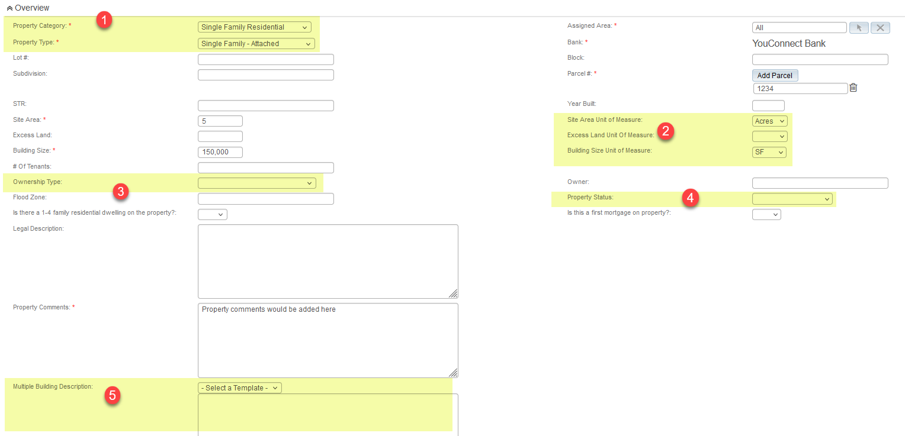
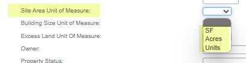
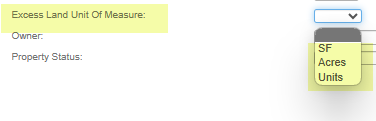
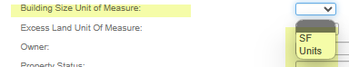
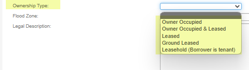
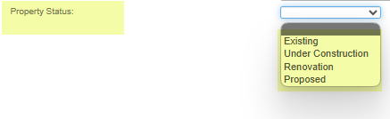
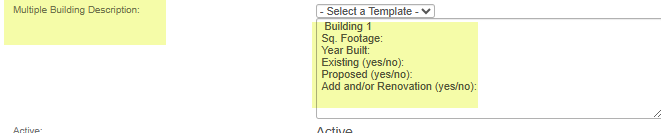
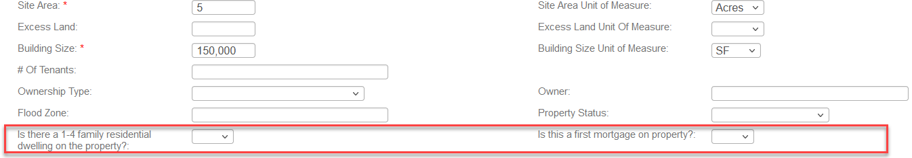

Property Record

Below is a screenshot of the Property Record with the  current  default fields.  In the Overview section you will find fields that will help to describe the property.  Most of  the fields are simply text fields, some are dropdown  value  fields,  and we have 1 field template .

Please advise if any fields need to be relabeled, removed or if a  new  field needs to be added  to further describe the property .  The fields you see with a  red *  indicate  that field is a required field an d will need  to be completed prior to moving on to the next page.  Please advise i f  any  additional fields need to be set as a required field and/or if  any  required field  d o  not need this requirement.  The  i tems  highlighted  in the screenshot  below  are dropdown value fields and/or a field template(s), you will find  additional information/description below the screenshot . Please note  the  Assigned Area   field  will be discussed  later . The field labeled  Bank   will  automatically populate the name of your bank.

Property Category/Property Type :  at this point you would have already received and completed the workbook and made your selections for your dropdown values.

Unit of Measure(s) fields are listed below with the default dropdown values. Please review and advise of any changes:

Site Area Unit of Measure

Excess Land Unit of Measure

Building Size Unit of Measure

Ownership Type  field listed below with the default dropdown values. Please review and advise of any changes:

Property Status  field are listed below with the default dropdown values. Please review and advise of any changes:

Multiple Building Description: In addition to this field allowing for “free type” this is what we call a  F ield  T emplate  and you are able to create multiple templates (you provide the wording and template name and we will enter on the back end of YouConnect). This will help to cut down on data entry and works well when repeated information needs to be populated for each property.  The template choices you see below in our default  are  just example s  and can be used or removed:

Once you select the appropriate template it will populate the applicable information that needs 
              to be answered:

Reg B Configuration  (if you chose to enable)

If Reg B notifications are required, typically for Residential types , the following two fields will be added to the property record layout on your site.  The dropdown values are Yes/No.  When BOTH are selected as Yes on the property record associated with a Request, the YouConnect system will automatically generate email notification s .

If a Request requires a Reg B Notification to be sent , you can decide if it is sent  when the Request is Initially submitted and/or upon Completion or both. You will need to supply us with the email address you would like the notification to be sent to .  Internal Note Only:   In addition  if any other people (LO ) needs to receive it you can check the box in Email set up.   Completed will send the email with one link if admin is checked as NO.

You also have the option to send a notification to a Reg B Administrator  and can decide to send at the Review complete or Request Complete stage.   Internal Note  only :   If yes selected it would send the completed email with  the 3 links but this one is NOT available in email set up grid .

Note* Reg B Notification can be disabled by Request Type – so if you only want Reg B on Residen tial orders for example.