Request Record – Job Manager  view

Request In fo  P anel

 Below you will find screenshots of the Request Record panels with the default fields.  Most of  the fields are simply text fields, some are dropdown value fields and  F ield  T emplates.  

Please advise if any field names need to be relabeled, removed or if a field needs to be added to further describe the request/order that is being placed for the specific property. The fields you see with  a  red  *  indicate  that field is a required field and will need to be completed prior to moving on to the next page. Please advise if any additional fields need to be set as a required field and/or if  any  current required field do es  not need this requirement.  The items highlighted in the first screenshot are dropdown value fields and/or  F ield  T emplate(s), you will find additional information/description below the screenshot. 

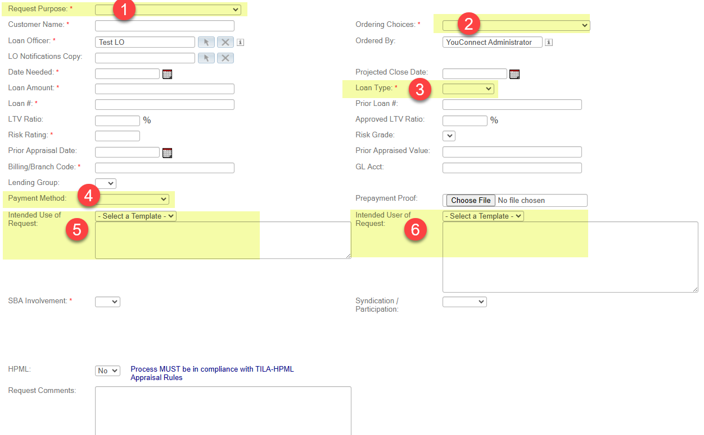

Request Purpose  field listed below with the default dropdown values. Please review and advise of any changes: 

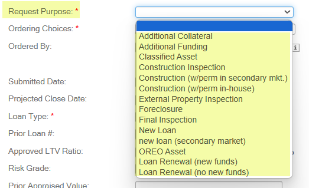

Ordering Choices field listed below with the default  dropdown  values. Please review and advise of any changes:

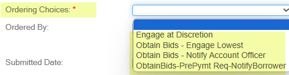 

Loan Type field listed below with the default dropdown values. Please review and advise of any changes:

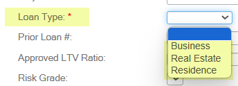

Payment Method field below with the default dropdown values.  This would be if you  require  Loan Officer to  advise  the payment method. 

               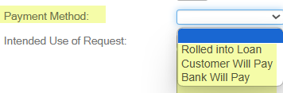

Intended Use  of Request :  In addition to this field allowing for “free type” this is what we call a  Field  Template   and you  are able to  create multiple templates (you provide the wording and template  name  and we will enter on the back end of YouConnect). This will help to cut down on data entry and works well when  repeated information needs to be populated for each property. The template choices you see below  in our default are just examples and can be used or removed  (FYI your bank name would be entered  in the template below where it says Bank Name): 

               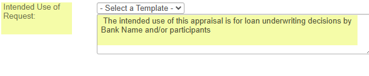

Intended User of Request is also a  Field Template :

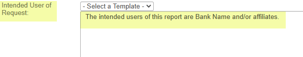

Special Note*

Date Needed  –  This  is the date the Loan Officer is asking to have the report returned to them .  One option i s  to relabel this to  Dated Needed (Report & Review)   if you   want to make it   clear to your   lenders  this would be the date for both the Report and Review to be completed. 

* Prior Appraisal Date and Prior Appraised Value  –   The L oan  O fficer ’s do not fill these  fields , however  if there was a previous  appraisal done  on a property ,  the next time a new order is submitted against th e  property th e  Prior Appraised Value & Date  will automatically populate.  We recommend you do not remove this from the Request Record.   

Billing / Branch Code (Also know n  as Cost Center)  & GL Acct  fields  are connected to  a Loan Officer’s user profile.  When a Loan Officer is selected on a Request , the Billing/Branch Code & GL Acct # will automatically populate  (only if the user record has these fields populated – when  we ingest your users into YouConnect you will be given the opportunity to provide  this information or we can explain to the Loan officers during their training they will need to update their profile to add in this information ) .

Lending Group –  if you use Lending Group s  for Accounting purposes please provide us with your list and we will add them  as selectable  values.  This will also be an availa ble  option to include on your user  list  and we will  discuss  further when we get to that section. 

HPML –  this is an old  function  and it is not normally used.  We will remove unless you say otherwise.

Request Comments -  These are the comments between the Loan Officer and the Job Manager

Contact Access Info  P anel

This information provides the necessary information   to  the appraiser  to be able to gain access to complete their work . Please review  the fields and advise of any changes . The items highlighted in the first screenshot  below  are dropdown value fields, you will find additional information/description  under the screenshot.

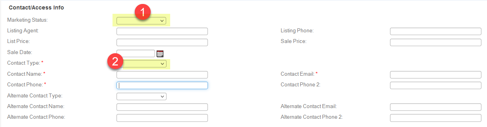

Marketing Status   field listed below with the default  dropdown  values. Please review and advise of any changes:

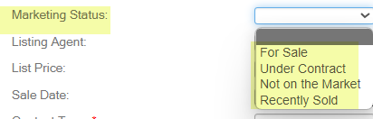  

Contact Type field listed below with the default dropdown values. Please review and advise if  any  changes:  

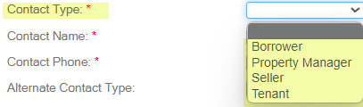

Environmental  Info  Bid/Engagement Panel  (only applies if doing Environmental orders) -  Job Manager View 

Through the fields in this panel, you can provide additional information to your  Environmental  vendors related to the scope of the assignment.  It is recommended to fill out all applicable fields before any vendors are solicited for bidding . 

Please advise if any of the dropdowns or checkboxes need to be adjusted, and if any  fields need  to be added, removed,  relabeled  or set as required. 

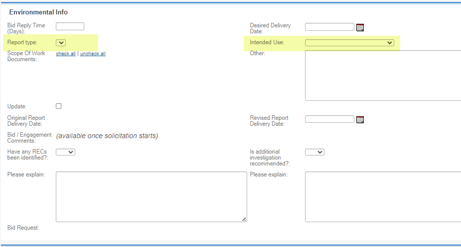

Dropdown  fields specific to this option:

Report  Type   (for Env orders) -   Please supply us with your Report Type selections for an environmental order.

Intended Use  (for Env order): Please  see screenshot below with default dropdown values. Please review and advise of any changes: 

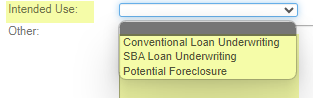 

Bid/Engagement Panel  for Appraisals – Job Manager View 

 Through the fields in this panel, you  can  provide additional info rmation  to your vendors  related to the  scope of the assignment.   It is recommended  to fill out all applicable fields before any vendors are solicited for bidding . 

There are 4  panel  configuration options that you can choose from, each with  a  different  layout and  Value Scenario fields .  Please choose the desired  configuration  option ,  advise  if any of the dropdowns  or checkboxes  need to be adjusted,  and  if  any   fields need  to be added, removed,  relabeled  or set as required . 

At a later stage   in  the configuration process, you’ll  also  have the option to choose  if  Loan Officers can  enter data within the   Value  Scenario fields at the time of Request su bmission. 

Using the arrows, p lease expand each optio n below   to find additional information .  
 
 N ote : Options 1 and 2 are  most commonly used ,  but if you have the business need for a panel that uses  c heckboxes or  d ropdowns  (no columns) , please  see  Options 3 and 4 . 

OPTION 1 

3 column option  with “Inspection Requirements” and “Approach to Value” underneath. 

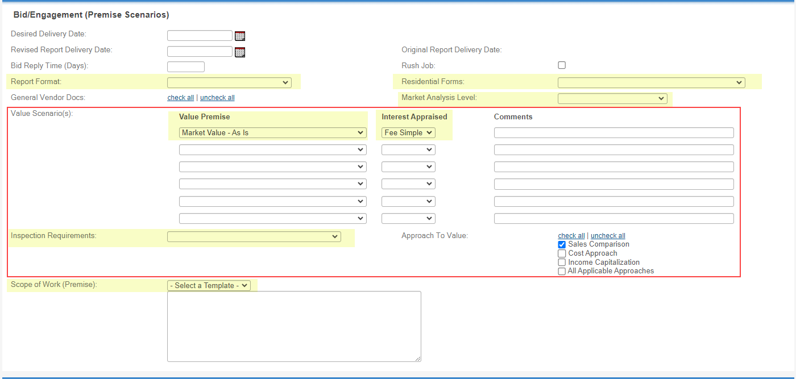

 Dropdown  fields specific to this option:

Value Premise  and  Interest Appraised  fields listed below with the default dropdown values. Please review and advise of any changes: 

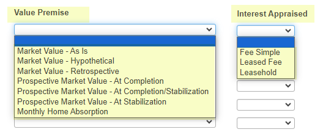 

Inspection Requirement   field listed below with the default dropdown values. Please review and advise of any changes:

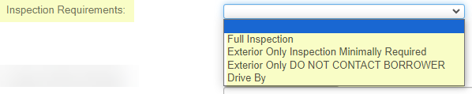

OPTION 2 

4 column option  with “Inspection Requirements” and “Approach to Value” underneath, and “Value Qualifier” in a separate column. 

Dropdown  fields specific to this option:

Value Premise ,  Value Qualifier  and  Interest Appraised  fields listed below with the default dropdown values. Please review and advise of any changes: 
 
 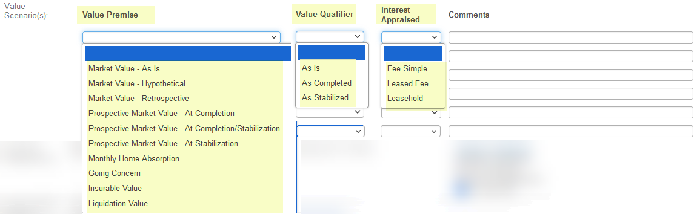 

Inspection Requirements  field listed below with the default dropdown values. Please review and advise of any changes: 
 
 

OPTION 3 

Checkboxes Option .

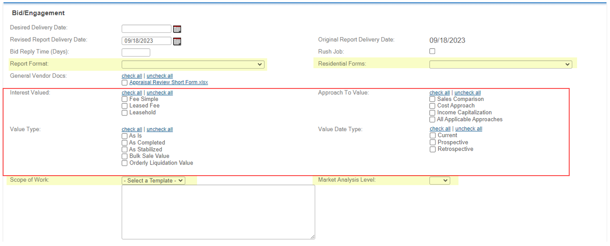

OPTION 4 

Dropdowns option with a  dedicated  field for “If Leased Fee” (Field Template). 

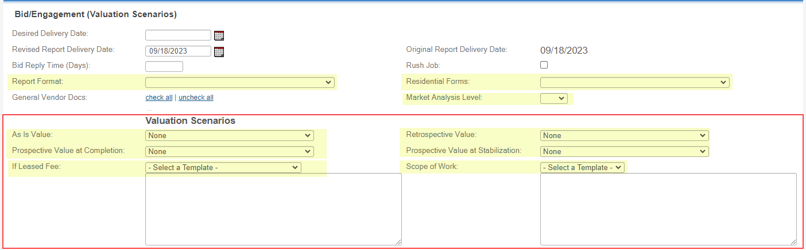

 Dropdown  fields specific to this option:

As is Value, Retrospective Value, Prospective Value at Completion  and  Prospective Value at Stabilization  fields share the same default dropdown values list. Please review and advise of any changes: 
 
 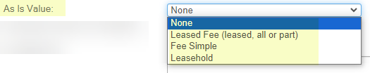 
 
 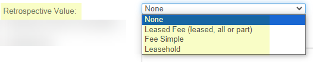 
 
 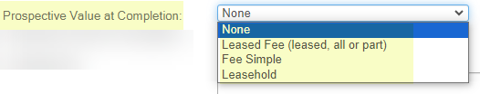 
 
 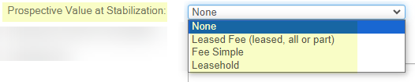 
 

If Leased Fee  – Field Template (see definition of “Field Templates” above).

Additional  Information  on the fields   that are  applicable to all 4 configuration options (to assist you with the decision-making process)

Desired Delivery Date  – specifies  the desired date by which the  assignment should be completed.  
 This  helps the vendors understand the urgency of the assignment before placing their bids (where applicable).     

Revised Report Delivery Date  –   allows a Job Manager to grant an extension to the engaged vendor.  
 A report submitted on or before that date will not be counted as “late”.  

Original Report Delivery Date  – populate s  automatically with the original report delivery date (before any potential changes are made). 

Bid Reply Time (Days )  –   the number of days that solicited vendors  have to  submit their bids.  
 Note: Bids can be submitted by solicited vendors up until a  vendor has been formally engaged.   

Ru s h Job  –  a checkbox field which simply indicates if this is a “Rush Job”. 

General Vendor Docs  – allows a Job Manager to select  the  general docs  that will become visible to  the vendors upon solicitation.  The desired  list of documents can be uploaded and updated at any time (during Onboarding and/or post Go-live). 

Scope of Work  - Field Template (see definition of “Field Templates” above) .

Residential Forms  field listed below with the default dropdown values. Please review and advise of any changes: 
 
 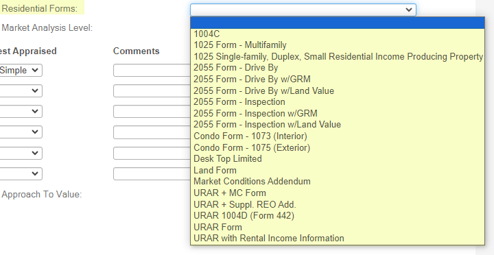 
 
 

Report Format  field listed below with the default dropdown values. Please review and advise of any changes: 
 
 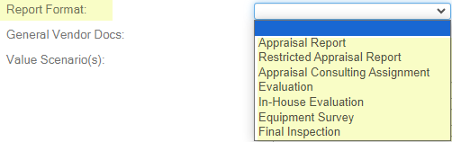 

Market Analysis Level  field listed below with the default  dropdown  values. Please review and advise of any changes: 
 
 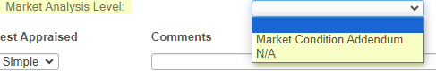

 

